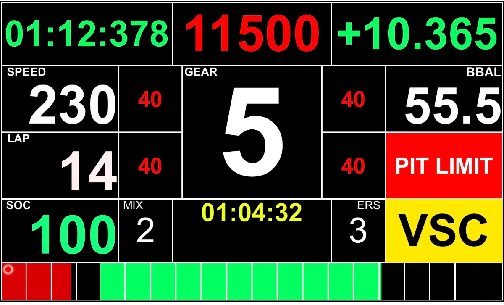

# Replica Dinamica della Dashboard Ferrari F1 2024

Una riproduzione interattiva della dashboard mostrata ai piloti Ferrari durante la stagione 2024 di Formula 1.

  

## Descrizione

Ricreare fedelmente e in modo dinamico la dashboard utilizzata dai piloti della Scuderia Ferrari nel 2024.  
La replica include elementi interattivi e visualizzazioni simulate

## Tecnologie Utilizzate

- **Linguaggi:** Python 

## Obiettivi del Progetto

- Replica grafica fedele all'originale
- Visualizzazione dinamica dei parametri: velocità, marcia, ERS, delta tempo, ecc.

## Clone repository
git clone https://github.com/FPR10/FerrariF1Dash.git

## Info
Francesco Pio Ruffo  
frff1010@gmail.com
